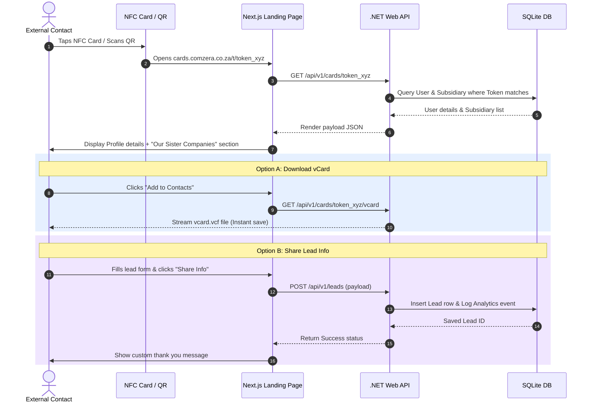

# Hybrid Functional and Technical Specification Document: Comzera Cards

This document defines the functional requirements and technical specifications for the development of **Comzera Cards** (Cards.Comzera.co.za). It serves as the project blueprint, aligning corporate sales/networking objectives with the Comzera Group standard technology stack and compliance policies.

---

## Document Control
- **Application Name**: Comzera Cards
- **Author**: Antigravity Spec Builder
- **Status**: Draft / Under Review
- **Version**: 1.0.0
- **Date**: 2026-06-22

---

# 1. Introduction

### Purpose of the Document
To define the end-to-end functional requirements, user experiences, data models, API endpoints, and system architecture for the Comzera Cards platform. This document ensures that the development of the dynamic NFC landing pages, lead capture CRM, and holding/subsidiary settings screens align with standard Comzera Group patterns.

### Scope of the Project
Development of a multi-tenant web application and REST API to manage NFC-enabled digital business cards and local sales leads.
- **Phase 1 Focus (MVP):**
  - Cardholder Profile creation and dynamic landing page layout.
  - Integration of physical NFC URLs (tokenized queries) to profile routes.
  - vCard (.vcf) compilation and instant browser download.
  - Lead Capture Form on landing pages.
  - Individual Cardholder Dashboard (leads list, tap metrics).
  - Holding & Subsidiary Settings (cross-promotion of sister companies on tap pages).
  - SQLite Relational Database configuration with persistence volume mount mapping.
- **Future Phases:**
  - Dynamic QR Code generator for custom print materials.
  - Team hierarchy groupings (e.g., specific departments or geographic regions).
  - Bulk employee import via CSV/Excel.
  - Native integrations with external CRMs (e.g., Salesforce, HubSpot).

### Target Audience
Developers, system designers, product managers, quality assurance engineers, and holdings administrators.

---

# 2. Executive Summary

### Project Overview
Comzera Cards is a dynamic business card platform and CRM lead manager corporate system tailored for holding groups. It enables employees to share their digital contact profiles simply by tapping an NFC card against a mobile device or scanning a QR code. 

Beyond single profile displays, the platform incorporates a Group Cross-Promotion feature: when a user scans or taps a card, the landing page displays other subsidiary companies under the parent holding company, encouraging cross-entity sales and visibility. Prospects can instantly download contact info or submit their own details, creating trackable leads in the employee's CRM dashboard.

### Problem Statement
Paper business cards are outdated, expensive, and easily discarded. They do not allow companies to measure networking efficacy or capture return leads systematically. 

Furthermore, holdings groups have multiple distinct subsidiaries. When an employee of one subsidiary meets a prospect, there is no easy mechanism to cross-promote or refer the prospect to sister companies under the same holding banner.

### Proposed Solution
Comzera Cards addresses these limitations through:
1. **Dynamic Mobile Card Profiles:** Hosted mobile-first landing pages loaded via a unique token on tap.
2. **Sister Subsidiary Settings & Cross-Promotion:** A dedicated settings panel allowing Holding and Subsidiary admins to add/edit sister brands, which then render dynamically as reference cards at the bottom of the cardholder's landing page.
3. **Frictionless Lead Capture:** Lead forms embedded on the landing page that pipe contact information directly into the cardholder's CRM dashboard and fire real-time email alerts.
4. **Visual CRM Dashboard:** Lightweight dashboard for individual cardholders and managers to monitor card views, tap volumes, lead capture metrics, and download CSV lead files.

### Key Features
- **Dynamic NFC Tap Landing Page:** Mobile-optimized profile page showing user photo, contact details, social links, vCard download, and sister group companies.
- **Group Cross-Promotion Grid:** Admin-editable links and logos highlighting sister subsidiaries.
- **Lead Capture Form:** Simple fields (Name, Email, Phone, Company, Notes) visible on the tap profile page.
- **Cardholder Analytics Dashboard:** Live visual tracking of NFC Taps, Lead conversions, and Contact downloads.
- **Holding & Subsidiary Settings:** Unified portal enabling admins to configure subsidiary descriptions, websites, and logos.

### Target Audience / Verticals
- **Holding & Subsidiary Admins:** HR or Operations teams who allocate card profiles and curate the sister companies catalog.
- **Cardholders (Sales & Reps):** Frontline employees who use NFC cards to network.
- **External Leads:** Clients, prospects, and partners who tap the card and input their details.

### Business Objectives
- Increase prospect engagement and reduce paper card printing overhead by 100%.
- Systematize lead capture from physical interactions.
- Maximize holding group cross-selling by exposing sister brands to 100% of landing page visitors.

---

# 3. Functional Specification

## 3.1 Functional Objectives
- **Centralized Group Config:** Allow admins to manage the parent holding group and its child subsidiaries.
- **NFC Tag Parsing:** Route incoming tag URLs (e.g. `cards.comzera.co.za/t/token`) to the correct employee profile.
- **Dynamic landing page:** Ensure loading speed is under 1.5s on mobile networks.
- **Sister Company Links:** Settings screen enabling administrators to manage sister brand lists.
- **Lead Capturing CRM:** Capture, list, search, and export lead contacts captured per cardholder.
- **vCard Compile:** Export employee info dynamically as a standard phone-readable vCard (.vcf).

## 3.2 User Personas

### Persona 1: Holding / Subsidiary Admin
| Attributes | Description |
| --- | --- |
| **Background** | Operations, HR, or Marketing Manager for the group. |
| **Goals** | Add new subsidiaries, upload branding assets, assign card profiles to employees. |
| **Technical Skills**| Basic browser/office software skills. |
| **Pain Points** | Hard to coordinate marketing info and keep track of employee networking leads. |
| **Core Scenario** | Logs into the settings page, adds a new subsidiary "Prosource", uploads its logo, and writes a brief description to showcase on all cards. |

### Persona 2: Sales Agent (Cardholder)
| Attributes | Description |
| --- | --- |
| **Background** | High-activity sales agent representing a subsidiary company. |
| **Goals** | Quickly share details and gather leads on the move. |
| **Technical Skills**| Basic mobile and app user. |
| **Pain Points** | Forgetting to follow up after exchanging paper cards. |
| **Core Scenario** | Taps their card on a client's iPhone. Client opens profile, submits contact details. Sales Agent sees the lead appear in their dashboard app immediately. |

---

## 3.3 User Stories and Acceptance Criteria

### Epic: Organization & Subsidiary Management
#### Story 1: Admin configures Subsidiary list
- **As an** Admin (Holding or Subsidiary Admin)
- **I want to** add and edit child companies under our holding company
- **So that** they appear in the cross-promotion section of employee cards.
- **Acceptance Criteria**:
  - The Admin must be able to input Name, Logo image file, Description, and website URL.
  - Saving the subsidiary writes records to the relational SQLite database.
  - The Admin can edit or toggle the visibility of each subsidiary.

### Epic: Cardholder Profile & NFC Association
#### Story 2: Associating NFC Token to Cardholder
- **As a** Subsidiary Admin
- **I want to** link a cryptographically random NFC token to an employee's profile
- **So that** scanning the physical card opens their details.
- **Acceptance Criteria**:
  - System supports setting or scanning a unique string token `NfcToken` on a user's record.
  - Tapping the NFC card redirects browser client to `/t/{NfcToken}`.
  - The API resolves `NfcToken` and returns the associated employee's card profile.

### Epic: Tap Experience & Lead Capture
#### Story 3: Dynamic Profile and Sister Companies View
- **As an** External Contact
- **I want to** tap the card, view the employee's profile, and see their sister companies
- **So that** I understand their group capabilities and can easily navigate to sister websites.
- **Acceptance Criteria**:
  - Mobile landing page displays the employee's details (Name, Job Title, Company, Bio, Phone, Email).
  - Page loads a list of all active subsidiaries under the same holding company (excluding the cardholder's own subsidiary).
  - vCard button downloads contact details locally to iOS/Android.

#### Story 4: Capturing Lead Information
- **As an** External Contact
- **I want to** fill in my details directly on the card page
- **So that** I can share my contact card back with the cardholder.
- **Acceptance Criteria**:
  - Submit form with FullName, Email, Phone, CompanyName, and Notes.
  - System writes lead info to database, links it to `CardProfileId`, and logs a tap analytics row.
  - Cardholder receives an automated email alerting them of the new lead.

---

## 3.4 Workflow Diagrams

### Card Tap, Lead Capture & Cross-Promotion Flow



---

## 3.5 Wireframes & Mockups

### Mobile View: NFC Card Landing Page
```text
+------------------------------------------+
|  [Logo] Comzera Group Logo               |
+------------------------------------------+
|                                          |
|            +-----------------+           |
|            |                 |           |
|            |  Profile Photo  |           |
|            |                 |           |
|            +-----------------+           |
|                                          |
|               John Doe                   |
|       Senior Consultant - Prosource      |
|                                          |
|  [Button: Save Contact to Phone (vCard)] |
|                                          |
|  Phone: +27 82 123 4567                  |
|  Email: john.doe@prosource.co.za         |
|  Bio: Helping enterprise teams scale...  |
|                                          |
|  +-- Lead Capture Form ----------------+ |
|  | Name:   [________________________]  | |
|  | Email:  [________________________]  | |
|  | Phone:  [________________________]  | |
|  | Company:[________________________]  | |
|  | [Button: Share My Contact Info]     | |
|  +-------------------------------------+ |
|                                          |
|  --- OUR SISTER COMPANIES ---            |
|  +-------------------------------------+ |
|  | [Logo] Comzera Solutions            | |
|  | Tech consultancy and cloud build.   | |
|  | [Link: Visit Site]                  | |
|  +-------------------------------------+ |
|  | [Logo] Cards.co                     | |
|  | Modern NFC networking systems.      | |
|  | [Link: Visit Site]                  | |
|  +-------------------------------------+ |
|                                          |
+------------------------------------------+
```

---

## 3.6 UI/UX Considerations

### Accessibility (WCAG 2.1 Level AA)
- **Interactive Targets:** Tap areas (buttons, links) must be a minimum of `48px x 48px` to accommodate mobile thumb taps.
- **Focus Ring States:** Outline visual rings must appear for all tab-navigated elements.
- **Contrast Check:** Color schemes must retain contrast ratios higher than `4.5:1` for body text.
- **Alt Text:** Employee pictures and sister logos must populate matching `alt` descriptions dynamically.

### Responsiveness
- Designed mobile-first. Dynamic card pages must render perfectly on viewports down to `320px` width.
- Dashboards use dynamic grid elements that collapse into single-column layouts on tablets and phones.

---

## 3.7 Functional Requirements (FR) Table

| Requirement ID | Module | Description | Status |
| --- | --- | --- | --- |
| `FR-AUTH-001` | Auth | Secure admin login/registration via JWT. | Proposed |
| `FR-CARD-001` | Cards | Dynamic NFC token routing to cardholder profile details. | Proposed |
| `FR-CARD-002` | Cards | Generate and download dynamic vCard file on click. | Proposed |
| `FR-LEAD-001` | Leads | Capture leads on landing page and store contact rows. | Proposed |
| `FR-LEAD-002` | Leads | Display leads list on individual user dashboard. | Proposed |
| `FR-ORG-001`  | Settings | CRUD screen for managing subsidiary listings (Name, Logo, Url, Description). | Proposed |
| `FR-ORG-002`  | Cards | Show sister companies on profile page dynamically. | Proposed |
| `FR-ANLY-001` | Analytics| Log NFC taps and show aggregate views vs leads metrics. | Proposed |

---

# 4. Technical Specification

## 4.1 Approved Technology Stack (Comzera Group Standard)
To ensure compliance with group infrastructure patterns, Comzera Cards is configured as follows:

- **Backend API Layer:**
  - **Runtime & Framework:** .NET 8.0 / .NET 10.0 (ASP.NET Core Web API)
  - **Language:** C#
  - **Data Access:** Entity Framework Core (EF Core) with SQLite driver
  - **Authentication:** JWT Bearer tokens utilizing ASP.NET Core Identity
- **Frontend Portal:**
  - **Framework:** Next.js 15 (React 19) utilising the App Router
  - **Language:** TypeScript
  - **Styling:** TailwindCSS 4
  - **Build Engine:** Turbopack
- **Database Architecture:**
  - **Engine:** SQLite Database (`comzera_cards.db`)
  - **Local Persistence Warning:**
    > [!WARNING]
    > **SQLite Persistence Constraints:** Because SQLite writes to a single local file, running this application in a containerized environment (Docker/Azure Web App) requires mounting the folder containing the `.db` file to a **persistent bind volume**. If run inside the container's ephemeral file system, restarts will wipe the database.

---

## 4.2 System Architecture & Decoupling
- **Next.js Client (SPA):** Communicates with the C# backend API entirely over HTTPS using JSON payloads.
- **Stateless Backend API:** The .NET Web API manages data operations, issues JWT tokens, and handles vCard output. It holds no local in-memory session states.
- **SQLite DB Access:** Directly bound to the .NET API layer via EF Core. No client-side applications can read or write to the database file directly.

---

## 4.3 Database Schema (relational SQL for SQLite)
The SQLite schema matches the entity properties and relationships defined below:

```sql
-- ========================================================
-- COMZERA CARDS SQLITE DATABASE SCHEMA CONFIGURATION
-- ========================================================

-- 1. Organizations (Holding & Subsidiary Entities)
CREATE TABLE "Organizations" (
    "Id" INTEGER PRIMARY KEY AUTOINCREMENT,
    "ParentId" INTEGER NULL,
    "Name" TEXT NOT NULL,
    "WebsiteUrl" TEXT NOT NULL,
    "LogoUrl" TEXT NOT NULL,
    "Description" TEXT NOT NULL,
    "CreatedAt" DATETIME NOT NULL DEFAULT CURRENT_TIMESTAMP,
    FOREIGN KEY ("ParentId") REFERENCES "Organizations"("Id") ON DELETE SET NULL
);

-- 2. Users Table
CREATE TABLE "Users" (
    "Id" INTEGER PRIMARY KEY AUTOINCREMENT,
    "OrganizationId" INTEGER NOT NULL,
    "Email" TEXT NOT NULL UNIQUE,
    "PasswordHash" TEXT NOT NULL,
    "Role" TEXT NOT NULL CHECK ("Role" IN ('HoldingAdmin', 'SubsidiaryAdmin', 'Cardholder')),
    "CreatedAt" DATETIME NOT NULL DEFAULT CURRENT_TIMESTAMP,
    FOREIGN KEY ("OrganizationId") REFERENCES "Organizations"("Id") ON DELETE CASCADE
);

-- 3. CardProfiles Table
CREATE TABLE "CardProfiles" (
    "Id" INTEGER PRIMARY KEY AUTOINCREMENT,
    "UserId" INTEGER NOT NULL UNIQUE,
    "NfcToken" TEXT NOT NULL UNIQUE,
    "FullName" TEXT NOT NULL,
    "Designation" TEXT NOT NULL,
    "Email" TEXT NOT NULL,
    "Phone" TEXT NOT NULL,
    "Bio" TEXT NOT NULL,
    "ProfileImageUrl" TEXT NOT NULL,
    "SocialLinksJson" TEXT NOT NULL, -- JSON string mapping keys: 'LinkedIn', 'Twitter', etc.
    "IsActive" INTEGER NOT NULL DEFAULT 1 CHECK ("IsActive" IN (0, 1)),
    "UpdatedAt" DATETIME NOT NULL DEFAULT CURRENT_TIMESTAMP,
    FOREIGN KEY ("UserId") REFERENCES "Users"("Id") ON DELETE CASCADE
);

-- 4. Leads Table
CREATE TABLE "Leads" (
    "Id" INTEGER PRIMARY KEY AUTOINCREMENT,
    "CardProfileId" INTEGER NOT NULL,
    "FullName" TEXT NOT NULL,
    "Email" TEXT NOT NULL,
    "Phone" TEXT NOT NULL,
    "CompanyName" TEXT NOT NULL,
    "Notes" TEXT NOT NULL,
    "CreatedAt" DATETIME NOT NULL DEFAULT CURRENT_TIMESTAMP,
    FOREIGN KEY ("CardProfileId") REFERENCES "CardProfiles"("Id") ON DELETE CASCADE
);

-- 5. TapAnalytics Table
CREATE TABLE "TapAnalytics" (
    "Id" INTEGER PRIMARY KEY AUTOINCREMENT,
    "CardProfileId" INTEGER NOT NULL,
    "Referrer" TEXT NOT NULL,
    "CreatedAt" DATETIME NOT NULL DEFAULT CURRENT_TIMESTAMP,
    FOREIGN KEY ("CardProfileId") REFERENCES "CardProfiles"("Id") ON DELETE CASCADE
);

-- Indices for rapid query lookups
CREATE INDEX "IX_CardProfiles_NfcToken" ON "CardProfiles" ("NfcToken");
CREATE INDEX "IX_Leads_CardProfileId" ON "Leads" ("CardProfileId");
CREATE INDEX "IX_TapAnalytics_CardProfileId" ON "TapAnalytics" ("CardProfileId");
```

---

## 4.4 API Endpoint Specifications
All endpoints route under `/api/v1` and require headers `Authorization: Bearer <JWT>` unless designated as `[Public]`.

### Auth Endpoints
- **`POST /api/v1/auth/login`** [Public]
  - **Request Body:** `{ "email": "admin@comzera.com", "password": "securepassword" }`
  - **Response (200 OK):** `{ "token": "jwt_token_string", "role": "HoldingAdmin" }`

### Card Profile Endpoints
- **`GET /api/v1/cards/{nfcToken}`** [Public]
  - **Description:** Returns profile metadata and matching sister companies list.
  - **Response (200 OK):**
    ```json
    {
      "profile": {
        "fullName": "John Doe",
        "designation": "Senior Consultant",
        "email": "john@prosource.co.za",
        "phone": "+27821234567",
        "bio": "Bio content...",
        "profileImageUrl": "/assets/john.jpg",
        "socialLinks": { "LinkedIn": "linkedin.com/in/johndoe" }
      },
      "sisterCompanies": [
        {
          "name": "Comzera Solutions",
          "websiteUrl": "https://comzera.co.za",
          "logoUrl": "/assets/logos/solutions.png",
          "description": "Tech consultancy..."
        }
      ]
    }
    ```
- **`GET /api/v1/cards/{nfcToken}/vcard`** [Public]
  - **Description:** Dynamically builds and returns a standard vCard v3.0 file download (`.vcf`).

### Settings & Subsidiaries Endpoints
- **`POST /api/v1/organizations`** [HoldingAdmin/SubsidiaryAdmin]
  - **Description:** Adds a new group subsidiary.
  - **Request Body:** `{ "name": "Company Name", "websiteUrl": "...", "logoUrl": "...", "description": "..." }`
- **`PUT /api/v1/organizations/{id}`** [HoldingAdmin/SubsidiaryAdmin]
  - **Description:** Updates subsidiary information.

### Leads & Analytics Endpoints
- **`POST /api/v1/leads`** [Public]
  - **Description:** Submits a prospect's lead details.
  - **Request Body:** `{ "cardProfileId": 1, "fullName": "Jane Client", "email": "jane@gmail.com", "phone": "0832345678", "companyName": "TechCorp", "notes": "Interested in sales" }`
- **`GET /api/v1/analytics/dashboard`** [Auth Required]
  - **Description:** Returns tap logs, conversion rates, and leads array for the logged-in user.

---

# 5. Non-Functional Requirements (NFR)

| Category | ID | Requirement Description | Threshold / Rule |
| --- | --- | --- | --- |
| **Performance** | `NFR-PERF-001` | Landing page API query execution time on token lookup. | < 150ms index query |
| **Performance** | `NFR-PERF-002` | vCard compiling and file output payload streaming. | < 500ms download start |
| **Security** | `NFR-SEC-001` | Encryption of customer/employee data in transit. | HTTPS TLS 1.2 minimum |
| **Reliability** | `NFR-RELI-001` | Storage backup schema. | Daily backup copy of SQLite `.db` file to remote cloud target |

---

# 6. POPIA / Security Compliance Checklist

### Data Minimization Registry
| Data Category | Data Item | Lawful Basis & Justification | Retention Period |
| --- | --- | --- | --- |
| **Employee Data** | FullName, Phone, Email, Photo | Consent: Required to assemble and render the dynamic contact card. | Profile lifetime. |
| **Lead Data** | Name, Phone, Email, Company, Notes | Consent: Provided explicitly by the prospect clicking "Share Info". | Retained for 2 years or until manual request to delete. |

### Security Safeguards
- [x] **SSL Transport Layer:** HTTPS enforcement on all API routing paths.
- [x] **No Ephemeral Loss:** Bound persistent folder volumes used for SQLite database safety.
- [x] **Right to Deletion:** Direct deletion actions from the lead dashboard clear records instantly.

---

# 7. Deployment & DevOps Plan

### Deployment Steps
1. **Build Phase:** Compile Next.js build using Turbopack, run Web API unit tests, compile C# build targets.
2. **Dockerization:** Create container images for backend API and frontend web portal.
3. **Mount Bind Volumes:** Mount Docker local hosts directories (e.g., `/var/data/comzera-cards/`) to containers for SQLite file persistence:
   - Run command: `docker run -v /var/data/comzera-cards:/app/data comzera-cards-api`

---

# 8. Glossary & Appendices

### Glossary
- **vCard (.vcf):** Virtual Contact File. Standardized format for storing personal and business contact details on mobile OS platforms.
- **SQLite:** A lightweight, serverless relational database engine running locally within the process space.
- **NfcToken:** The unique key appended to cards' NFC chips (e.g. `/t/xyz123`) to identify individual employee profile records.
