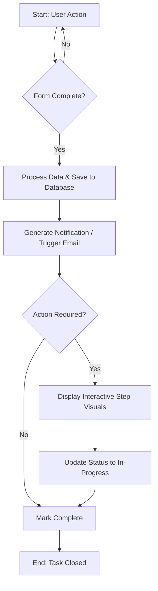

# Hybrid Functional and Technical Specification Document: {{PROJECT_NAME}}

*Instructions: This is the standardized blueprint/template for Comzera Group applications. Replace all double-curly brace placeholders (e.g., `{{PLACEHOLDER}}`) and bracketed instructions with specific details for your new application. Default selections in the technical section must be adhered to unless explicit exemption is approved by Dian Marx.*

---

## Document Control
- **Application Name**: {{PROJECT_NAME}}
- **Author**: {{AUTHOR_NAME}}
- **Status**: Draft / Under Review / Approved
- **Version**: 1.0.0
- **Date**: {{CURRENT_DATE}}

---

# 1. Introduction

### Purpose of the Document
{{PURPOSE_OF_THE_DOCUMENT}}
*(e.g., To define the functional requirements and technical specifications for the development of {{PROJECT_NAME}}.)*

### Scope of the Project
{{PROJECT_SCOPE}}
*(e.g., Development of a SaaS/web/mobile application to solve [Problem]. Details the target features of the MVP and subsequent phases.)*

### Target Audience
Developers, stakeholders, product managers, QA engineers, and system administrators.

---

# 2. Executive Summary

### Project Overview
{{PROJECT_OVERVIEW}}
*(A high-level summary of what this application does, who it serves, and its core value proposition.)*

### Problem Statement
{{PROBLEM_STATEMENT}}
*(Describe the specific challenges or gaps in the market/business processes that this application is designed to solve.)*

### Proposed Solution
{{PROPOSED_SOLUTION}}
*(Explain how the application solves the problem statement, including the core user workflows.)*

### Key Features
- **Feature 1**: {{FEATURE_1_NAME}} - {{FEATURE_1_DESC}}
- **Feature 2**: {{FEATURE_2_NAME}} - {{FEATURE_2_DESC}}
- **Feature 3**: {{FEATURE_3_NAME}} - {{FEATURE_3_DESC}}
- **Feature 4**: {{FEATURE_4_NAME}} - {{FEATURE_4_DESC}}

### Target Audience / Verticals
- **User Cohort 1**: {{COHORT_1}} (e.g., Business administrators)
- **User Cohort 2**: {{COHORT_2}} (e.g., Field operators)

### Business Objectives
- **Objective 1**: {{OBJECTIVE_1}}
- **Objective 2**: {{OBJECTIVE_2}}

---

# 3. Functional Specification

## 3.1 Functional Objectives
- **Secure Authentication**: Provide roles-based access controls for platform users.
- **Workflow Guidance**: Support step-by-step guidance for users executing core domain workflows.
- **Data Capture & Validation**: Allow simple forms, validation controls, and data uploading where appropriate.
- **Analytics & Reporting**: Display interactive charts and support exports of core domain data.
- {{ADDITIONAL_FUNCTIONAL_OBJECTIVE}}

## 3.2 User Personas
*Instructions: Fill out a profile for each critical user persona interacting with the system.*

### Persona 1: {{PERSONA_1_NAME}} (e.g., The Administrator)
| Attributes | Description |
| --- | --- |
| **Background** | {{PERSONA_1_BACKGROUND}} |
| **Goals** | {{PERSONA_1_GOALS}} |
| **Technical Skills**| {{PERSONA_1_SKILLS}} |
| **Pain Points** | {{PERSONA_1_PAIN_POINTS}} |
| **Core Scenario** | {{PERSONA_1_SCENARIO}} |

### Persona 2: {{PERSONA_2_NAME}} (e.g., The End-User)
| Attributes | Description |
| --- | --- |
| **Background** | {{PERSONA_2_BACKGROUND}} |
| **Goals** | {{PERSONA_2_GOALS}} |
| **Technical Skills**| {{PERSONA_2_SKILLS}} |
| **Pain Points** | {{PERSONA_2_PAIN_POINTS}} |
| **Core Scenario** | {{PERSONA_2_SCENARIO}} |

---

## 3.3 User Stories and Acceptance Criteria
*Instructions: List the core user stories and their matching acceptance criteria (AC) to serve as a guide for QA and developers.*

### Epic: Authentication & Access Control
#### Story 1: Account Registration
- **As a** {{USER_ROLE}}
- **I want to** register for a new account
- **So that I can** access the application features.
- **Acceptance Criteria**:
  - The system must register users via a valid email address and password.
  - Email addresses must be validated and password strength rules enforced.
  - A confirmation email must be triggered upon registration.
  - The account record must be created in the primary database and linked via ASP.NET Core Identity.

#### Story 2: Secure Login
- **As a** {{USER_ROLE}}
- **I want to** log in securely
- **So that I can** access my private records.
- **Acceptance Criteria**:
  - The system must authenticate users using credentials via the ASP.NET Core Identity endpoint.
  - Passwords must be hashed using PBKDF2/BCrypt as managed by Identity Core.
  - Successful authentication must return a stateless JWT token.

### Epic: Core Domain Management
#### Story 3: Inputting Domain Records
- **As a** {{USER_ROLE}}
- **I want to** input new {{DOMAIN_ENTITY_NAME}} details
- **So that I can** create a new record in the system.
- **Acceptance Criteria**:
  - Form validation must block submission of incomplete/malformed mandatory fields.
  - Numeric values must respect correct formatting constraints.
  - Uploaded supporting documents must be saved to Azure Blob Storage and associated with the record.

#### Story 4: Search and Filter Records
- **As a** {{USER_ROLE}}
- **I want to** search and filter records by {{SEARCH_CRITERIA}}
- **So that I can** find specific files quickly.
- **Acceptance Criteria**:
  - Searching by text must query target columns in Azure SQL / SQLite.
  - Filtering must support quick selections of record status.

### Epic: Core Guided Workflow
#### Story 5: Guided Workflow Steps
- **As a** {{USER_ROLE}}
- **I want to** follow a visual step-by-step workflow for {{WORKFLOW_NAME}}
- **So that I can** progress tasks in compliance with policy/legal guidelines.
- **Acceptance Criteria**:
  - The frontend must show a visual timeline showing completed, active, and upcoming steps.
  - Each step must show contextual guidance and document template recommendations.

---

## 3.4 Workflow Diagrams
*Instructions: Use Mermaid syntax to specify the application workflows.*



---

## 3.5 Wireframes & Mockups
*Instructions: Insert layout structures in ASCII boxes below or link to external Figma/design assets.*

### Layout: Dashboard View
```text
+-----------------------------------------------------+
| [Logo]  {{PROJECT_NAME}} Dash                        |
|-----------------------------------------------------|
| [Nav: Dashboard | Records | Reports | Settings]     |
|-----------------------------------------------------|
| Metrics Overview:                                   |
| - Total Items: [Value]     - Completed: [Value]     |
|-----------------------------------------------------|
| Recent Activity:                                    |
| - [Record 1] - [Status] - [Timestamp]               |
| - [Record 2] - [Status] - [Timestamp]               |
|-----------------------------------------------------|
| [Button: Create New Record]                         |
+-----------------------------------------------------+
```

---

## 3.6 UI/UX Considerations

### Accessibility (WCAG 2.1 Level AA Compliance)
The system must be designed to be accessible to all users, adhering to WCAG 2.1 AA.
- **Contrast**: Normal text must maintain a minimum contrast ratio of 4.5:1.
- **Keyboard Navigation**: All interactive elements must receive focus and be operable via tab-key navigation.
- **Form Controls**: Every input field must have an explicit label tag associated by ID.
- **Screen Readers**: All non-text content (images, SVG icons) must have descriptive `alt` text or `aria-label` markers.

### Responsiveness
- Grid and flexbox layouts must use relative values (rem, %, vh/vw) rather than hardcoded pixels.
- Implement CSS media queries targeting mobile, tablet, and desktop layouts.
- Always include the viewport meta tag: `<meta name="viewport" content="width=device-width, initial-scale=1.0">`.

### User Feedback Patterns
- **Toast Notifications**: Green check banners for successful operations, Red banners for errors.
- **Loading Spinners**: Shown dynamically during asynchronous API fetches.
- **Confirmation Modals**: Enforced for highly consequential actions (e.g., deletions, submissions).

---

## 3.7 Functional Requirements (FR) Table
*Instructions: Add items as needed, keeping the naming scheme format `FR-[SECTION]-[ID]`. Checkboxes indicate status for development.*

| Requirement ID | Section | Description | Status |
| --- | --- | --- | --- |
| `FR-AUTH-001` | Auth | User registration via email/password. | Proposed |
| `FR-AUTH-002` | Auth | User login yielding JWT token. | Proposed |
| `FR-AUTH-003` | Auth | Password reset request mechanism. | Proposed |
| `FR-DOM-001` | Domain | Form-based input for new domain entities. | Proposed |
| `FR-DOM-002` | Domain | Document uploads associated with entity ID. | Proposed |
| `FR-FLOW-001` | Workflow| Visual timeline tracking progress. | Proposed |
| `FR-FLOW-002` | Workflow| Context-aware help prompts per active step. | Proposed |
| `FR-REP-001` | Reporting| Export data as CSV/PDF format. | Proposed |

---

# 4. Technical Specification

## 4.1 Approved Technology Stack (Comzera Group Standard)
*Deviations from this stack require explicit written authorization from Dian Marx.*

- **Backend API Layer**:
  - **Runtime & Framework**: .NET 10 (ASP.NET Core Web API)
  - **Language**: C#
  - **Data Access & ORM**: Entity Framework Core (EF Core)
  - **Authentication**: ASP.NET Core Identity with stateless JWT (JSON Web Tokens)
- **Frontend Web Portal**:
  - **Framework**: Next.js (React) leveraging the App Router
  - **Language**: TypeScript
  - **Styling**: TailwindCSS
  - **Build Engine**: Turbopack
- **Mobile Applications (Expo)**:
  - **Framework**: React Native managed via Expo
  - **Language**: TypeScript
  - **Offline Storage**: Local secure sandbox (buffering base64 payloads prior to sync)
- **Database & Cloud Infrastructure**:
  - **Primary Relational DB**: Azure SQL Database (Microsoft SQL Server)
  - **Small-Scale Relational DB**: SQLite (Approved for lightweight, low-cost services)
    > [!WARNING]
    > **SQLite Docker Volume Constraint**: If running SQLite in a containerized environment (Docker/Azure App Service), the SQLite `.db` file **must** reside on a mapped persistent bind mount or Docker volume. If left inside the ephemeral container, restarts will result in total data loss.
  - **Cloud Hosting**: Microsoft Azure App Service running Linux Docker Containers.
  - **Deployment Mechanism**: CI/CD Pipelines configured with `WEBSITE_RUN_FROM_PACKAGE` for zero-downtime, immutable rollouts.
  - **Storage**: Azure Blob Storage (for media, document attachments, and backups).

### Approved Technical Exemptions
*List any pre-approved architecture exemptions here.*
- **None** / *[e.g., Python authorized for ML model scoring by Dian Marx on YYYY-MM-DD]*

---

## 4.2 System Architecture & Decoupling
- **Frontend SPA**: Next.js client interacts with backend services entirely over HTTPS via JSON REST APIs.
- **Mobile Expo App**: React Native client interacts with backend services via the same JWT-secured REST APIs.
- **Backend API**: Stateless service architecture. No session state is held in memory on the container instances.
- **Database**: Access is limited strictly to the .NET 10 API layer. Frontend or mobile clients are blocked from direct connections.

---

## 4.3 Database Schema (ERD Template)
*Instructions: Customize this Mermaid entity relationship diagram to model your application database.*

```mermaid
erDiagram
    Users {
        INT UserId PK
        VARCHAR Email UNIQUE
        VARCHAR PasswordHash
        VARCHAR Role
        DATETIME DateCreated
    }
    
    Clients {
        INT ClientId PK
        VARCHAR ClientName
        VARCHAR ContactEmail
    }

    DomainRecords {
        INT RecordId PK
        INT ClientId FK
        INT UserId FK
        DECIMAL ValueAmount
        VARCHAR RecordStatus
        DATETIME DateCreated
    }

    AttachedDocuments {
        INT DocumentId PK
        INT RecordId FK
        VARCHAR DocumentType
        VARCHAR BlobStoragePath
        DATETIME DateUploaded
    }

    Users ||--o{ Clients : "manages"
    Clients ||--o{ DomainRecords : "has"
    Users ||--o{ DomainRecords : "handles"
    DomainRecords ||--o{ AttachedDocuments : "references"
```

---

## 4.4 API Endpoint Specifications
All API endpoints route under `/api/v1` and require the header `Authorization: Bearer <JWT_TOKEN>` unless designated as Public.

### Auth Endpoints
- **`POST /auth/register`** [Public]
  - **Description**: Registers a new user account.
  - **Response (201 Created)**: `{ "userId": 123, "email": "user@example.com" }`
- **`POST /auth/login`** [Public]
  - **Description**: Verifies credentials and returns JWT token.
  - **Response (200 OK)**: `{ "token": "eyJhb...", "expiresInSeconds": 3600 }`

### Domain Record Endpoints
- **`GET /api/v1/records`** [Auth Required]
  - **Description**: List all active records filtered by client context.
  - **Response (200 OK)**: `[ { "recordId": 1, "valueAmount": 100.00, "recordStatus": "Open" } ]`
- **`POST /api/v1/records`** [Auth Required]
  - **Description**: Creates a new record.
  - **Request Body**: `{ "valueAmount": 100.00, "description": "Sample text" }`
  - **Response (201 Created)**: `{ "recordId": 2, "valueAmount": 100.00 }`
- **`POST /api/v1/records/{recordId}/documents`** [Auth Required]
  - **Description**: Upload a document to associate with a record (Multipart form-data).
  - **Request Body**: Binary file payload, `documentType` metadata.
  - **Response (201 Created)**: `{ "documentId": 10, "blobStoragePath": "azure-blob-url/doc.pdf" }`

### Error Response Schema
```json
{
  "error": "Bad Request / Unauthorized / NotFound / ServerError",
  "message": "Detailed error context explaining what went wrong and how the client should handle it."
}
```

---

## 4.5 Coding Standards & Conventions

### General Principles
- **KISS** (Keep It Simple, Stupid): Avoid premature abstraction or over-engineering.
- **DRY** (Don't Repeat Yourself): Shared logic must reside in shared services or utilities.
- **SRP** (Single Responsibility): Classes/components do one thing.

### C# Coding Guidelines (.NET 10)
- Naming: `PascalCase` for Classes, Interfaces (`I` prefix), Methods, and Properties. `camelCase` for local variables and parameters. `_camelCase` for private fields.
- Braces: All control blocks (`if`, `foreach`, `while`) must use matching braces starting on a new line.
- Async: Always utilize async/await patterns for I/O operations (EF Core calls, blob operations, SMTP requests).

### TypeScript Guidelines (Next.js & React Native)
- Naming: `PascalCase` for components. `camelCase` for utility methods, hooks, and variables.
- Typing: Avoid the `any` keyword. All interfaces and custom response shapes must be explicitly declared in `.d.ts` files or component-adjacent files.
- Formatting: Enforce Prettier (2-space tabs) and ESLint rules.

### Git Branching Model (Gitflow)
- **`main`**: Production code only. Direct commits are blocked.
- **`develop`**: Central integration branch for current release.
- **Feature Branches (`feature/your-feature`)**: Branched from `develop`, merged back via approved pull request.
- **Hotfix Branches (`hotfix/issue`)**: Branched from `main` to address production faults, merged to both `main` and `develop`.

---

# 5. Non-Functional Requirements (NFR)

*Instructions: Edit target threshold numbers to fit performance expectations for your new application.*

| Category | ID | Requirement Description | Threshold / Rule |
| --- | --- | --- | --- |
| **Performance** | `NFR-PERF-001` | API Response latency for core reads. | < 2.0 seconds under peak load |
| **Performance** | `NFR-PERF-002` | Dashboard database fetch load time. | < 3.0 seconds |
| **Scalability** | `NFR-SCALE-001` | System must scale horizontally. | Scale up containers on Azure based on CPU > 75% |
| **Security** | `NFR-SEC-001` | Encryption of data in transit. | HTTPS TLS 1.2 minimum |
| **Security** | `NFR-SEC-002` | Encryption of data at rest. | Transparent Data Encryption (TDE) for Azure SQL / BitLocker |
| **Reliability** | `NFR-RELI-001` | Application availability. | 99.9% uptime SLA |
| **Reliability** | `NFR-RELI-002` | Automated backups. | Weekly full backup, daily differential |
| **Usability** | `NFR-USE-001` | Responsive design bounds. | Visual integrity down to 320px viewport |

---

# 6. POPIA / Security Compliance Checklist

*Instructions: Comzera Group requires compliance with the South African Protection of Personal Information Act (POPIA). Ensure all fields processing personal info are documented.*

### Data Minimization Registry
| Data Category | Data Item | Lawful Basis & Justification | Retention Period |
| --- | --- | --- | --- |
| **User Data** | Email, Name | Consent: Necessary for authentication and app configuration. | Retained for account lifetime. |
| **Client Data** | Company Name, Email | Contractual: Required for billing and system operations. | 5 years post contract termination. |
| **Target Data** | {{DOMAIN_DATA_ITEM}} | {{JUSTIFICATION}} | {{RETENTION_PERIOD}} |

### Security Safeguards Check
- [ ] **Encryption**: Data is encrypted at rest (AES-256) and in transit (HTTPS).
- [ ] **Access Logs**: Audit logs record all read/write activities to records containing personal identifiers.
- [ ] **Consent Capture**: Electonic capture of user consent is recorded with timestamps.
- [ ] **Data Erasure**: System supports soft-deletion and anonymization tools to fulfill "Right to Deletion" requests.

---

# 7. Deployment & DevOps Plan

### Deployment Stages
1. **Development (`dev`)**: Automatic pipeline runs on merge to `develop` branch.
2. **Staging (`stage`)**: Released manually for QA verification. Mirrors production.
3. **Production (`prod`)**: Released on merge to `main` branch. Zero-downtime blue/green deployment context.

### CI/CD Configuration (Azure DevOps / GitHub Actions)
- **Build Step**: Compile C# code, install Node dependencies, compile Next.js (using Turbopack), run unit tests.
- **Publish Step**: Bundle backend API output and frontend assets into container images.
- **Deploy Step**: Push images to Azure Container Registry and update Azure App Service using `WEBSITE_RUN_FROM_PACKAGE`.

---

# 8. Glossary & Appendices

### Glossary
- **JWT**: JSON Web Token. Standard for transmitting securely encrypted auth assertions.
- **EF Core**: Entity Framework Core. Object-relational mapper for .NET.
- **POPIA**: Protection of Personal Information Act (South Africa).
- **WEBSITE_RUN_FROM_PACKAGE**: Azure deployment model running the app directly from a mounted ZIP archive.

### Appendices
- **Exemption Board Contacts**: Dian Marx (dian@comzera.com)
- **Approved External Services**: SendGrid (SMTP), Azure Blob Service (Storage)
